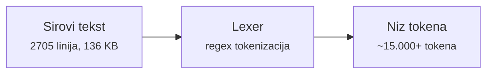
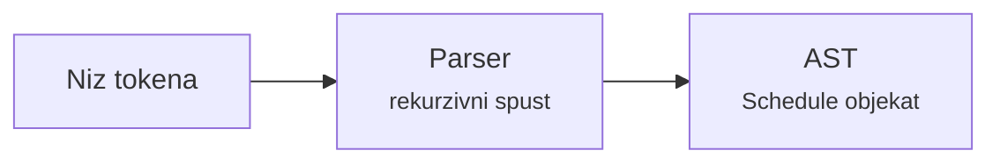
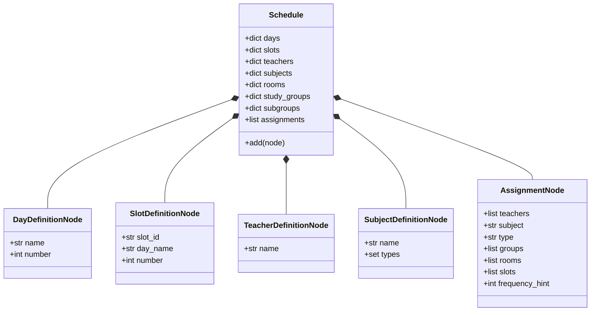
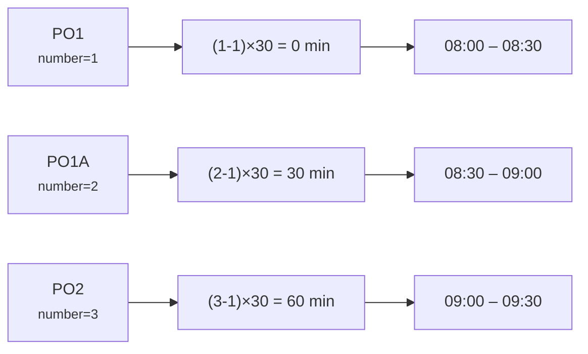
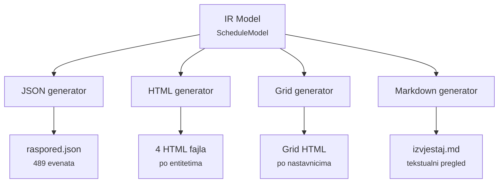
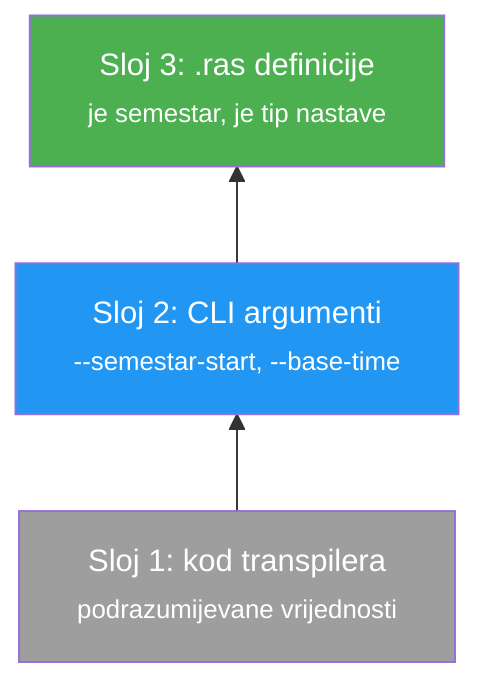
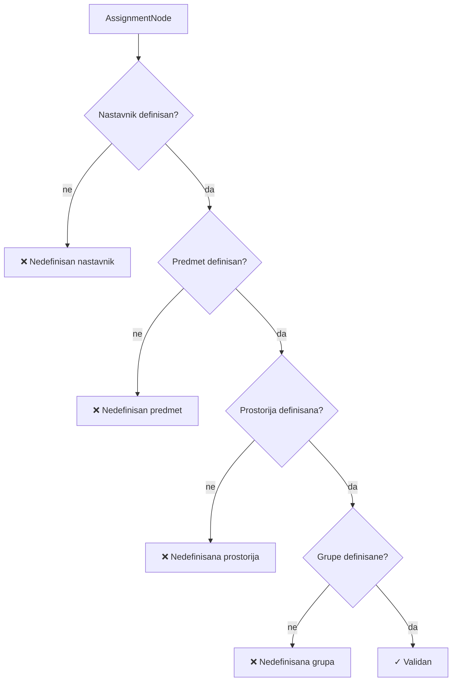
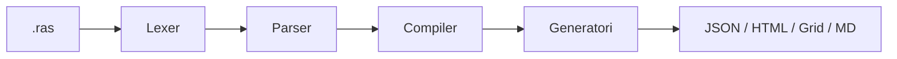

# Izgradnja transpilera za domenski specifični jezik za opis akademskih rasporeda

**Autor:** Ernedin Zajko  
**Kontakt:** ezajko@root.ba  
**Datum:** Februar 2026.  
**Predmet:** Programski jezici i prevodioci

---

## Sadržaj

1. [Uvod](#1-uvod)
2. [Analiza ulaznog koda](#2-analiza-ulaznog-koda)
3. [Prepoznavanje obrazaca i izvođenje gramatike](#3-prepoznavanje-obrazaca-i-izvođenje-gramatike)
4. [Leksička analiza — Lexer](#4-leksička-analiza--lexer)
5. [Sintaksna analiza — Parser](#5-sintaksna-analiza--parser)
6. [Semantička analiza — Compiler (AST → IR)](#6-semantička-analiza--compiler-ast--ir)
7. [Generisanje izlaza](#7-generisanje-izlaza)
8. [Proširenja jezika](#8-proširenja-jezika)
9. [Validacija i eksport](#9-validacija-i-eksport)
10. [Zaključak](#10-zaključak)
11. [Reference](#11-reference)

---

## 1. Uvod

### 1.1 Problemska postavka

Pred nama se nalazi tekstualni fajl `raspored_test.ras` koji sadrži 2705 linija koda napisanog u nepoznatom jeziku. Fajl opisuje akademski raspored Elektrotehničkog fakulteta Univerziteta u Sarajevu sa preko 140 nastavnika, 150 predmeta, 38 prostorija i blizu 500 iskaza nastave. Jezik nije dokumentovan i nema postojeći parser.

**Cilj** ovog rada je:

1. analizirati izvorni kod i prepoznati jezičke obrasce
2. formalizovati gramatiku jezika u EBNF notaciji
3. izgraditi kompletni transpilerni pipeline: lexer → parser → compiler → generatori
4. transformisati ulazni kod u strukturirane izlazne formate (JSON, HTML, Markdown)

### 1.2 Pristup

Jezik tretiramo kao *black box* — ne poznajemo njegovu specifikaciju, već je izvodimo induktivno iz analize postojećeg fajla. Ovaj pristup odražava realnu situaciju u kompajlerskom inženjeringu: zatečeni (*legacy*) jezici često nemaju formalnu specifikaciju i moraju se reverse-engineerovati iz primjera.

### 1.3 Tehnologija

Transpiler je implementiran u Pythonu 3. Ne koriste se generatori parsera (ANTLR, PLY) — lexer i parser su napisani ručno, čime je zadržana puna kontrola nad obradom grešaka i proširivošću.

---

## 2. Analiza ulaznog koda

### 2.1 Prvo posmatranje

Otvaranjem fajla `raspored_test.ras` uočavamo nekoliko karakteristika na prvi pogled:

- svaka linija završava tačkom (`.`) — terminator iskaza
- jezik koristi bosanske ključne riječi (`je`, `predaje`, `odjeljenju`, `prostoriji`)
- identifikatori koriste CamelCase (`ElmedinSelmanovic`, `pInzenjerskaMatematika1`)
- postoje komentari (`//` i `/* */`)

### 2.2 Kategorije iskaza

Analizom prvih stotinu linija prepoznajemo četiri fundamentalne kategorije iskaza:

**Kategorija 1: Definicije dana i termina**

```ras
Ponedjeljak je dan broj 1.
PO1 je termin broj 1 dana Ponedjeljak.
PO1A je termin broj 2 dana Ponedjeljak.
```

Uzorak: `ID je dan broj NUMBER.` i `ID je termin broj NUMBER dana ID.`

Prvih 135 linija definišu 5 dana i 130 termina. Svaki dan ima 26 termina (13 parova: PO1/PO1A, PO2/PO2A, ..., PO13/PO13A). Sufiks `A` sugerira da se termin dijeli na dva polučasovna bloka.

**Kategorija 2: Definicije entiteta**

```ras
pInzenjerskaMatematika1 je predmet.
ElmedinSelmanovic je nastavnik.
R0-02 je prostorija.
RI1 je odjeljenje.
RI1-1a je grupa odjeljenja RI1.
```

Uočavamo pet tipova definicija: `je predmet`, `je nastavnik`, `je prostorija`, `je odjeljenje`, `je grupa odjeljenja ID`. Poslednji oblik uspostavlja hijerarhijsku vezu — grupa (podgrupa) pripada odjeljenju.

Nazivi predmeta imaju prefikse: `p` (predavanje), `t` (tutorijal), `l` (laboratorija). Isti predmet se pojavljuje više puta sa različitim prefiksima:

```ras
pInzenjerskaMatematika1 je predmet.     // predavanje
tInzenjerskaMatematika1 je predmet.     // tutorijal
```

**Kategorija 3: Iskazi nastave**

```ras
NaidaMujic predaje pInzenjerskaMatematika1 odjeljenju RI1
    u prostoriji A1 4 puta sedmicno tacno u terminu UT2 UT2A UT3 UT3A.
```

Ova kategorija je najsloženija. Raščlanjivanjem uočavamo sljedeće komponente:

| Komponenta | Primjer | Obavezna |
|:---|:---|:---|
| nastavnik(ci) | `NaidaMujic` ili `AmerSmajkic i AdnanOsmanovic` | da |
| ključna riječ | `predaje` | da |
| predmet | `pInzenjerskaMatematika1` | da |
| grupe | `odjeljenju RI1` ili `odjeljenju RI1-1a, RI1-1b` | da |
| prostorija | `u prostoriji A1` | ne |
| frekvencija | `4 puta sedmicno` | ne |
| termini | `tacno u terminu UT2 UT2A UT3 UT3A` | da |
| terminator | `.` | da |

Posebno je interesantan slučaj višestrukih nastavnika spojenih veznikom `i`:

```ras
AmerSmajkic i AdnanOsmanovic i MirzaHamza predaje pOsnoveElektrotehnike
    odjeljenju RI1 u prostoriji A1 4 puta sedmicno
    tacno u terminu PO5 PO5A PO6 PO6A.
```

**Kategorija 4: Komentari i nepoznate konstrukcije**

```ras
// komentar jednolinijski
/* blok komentar */

Dvocasi je smjena sastavljena od PO1, PO2, ... .     // neprepoznato
R0-01 je nedostupan u PO7, PO7A.                       // neprepoznato
```

Neke konstrukcije (`smjena`, `nedostupan`) ne spadaju u gornje kategorije. Transpiler ih mora gracilno preskočiti uz upozorenje.

### 2.3 Statistički pregled ulaza

Na osnovu analize kompletnog fajla:

| Kategorija | Broj | Napomena |
|:---|:---:|:---|
| Dani | 5 | Ponedjeljak–Petak |
| Termini (slotovi) | 130 | 26 po danu |
| Nastavnici | 141 | uključujući demonstratore |
| Predmeti | 152 | sa prefiksima p/t/l |
| Prostorije | 38 | oznake R0-01, A1, EE-1, ... |
| Odjeljenja | 26 | RI1, EE2, TK3, RIM1, ... |
| Podgrupe | 383 | RI1-1a, AE2ds-1, ... |
| Iskazi nastave | 491 | uključujući komentirane |

---

## 3. Prepoznavanje obrazaca i izvođenje gramatike

### 3.1 Od primjera do pravila

Na osnovu analize iz poglavlja 2, formalizujemo prepoznate obrasce u EBNF notaciji. EBNF (*Extended Backus–Naur Form*) je standardna notacija za opis kontekstno-slobodnih gramatika [2].

### 3.2 EBNF gramatika RAS jezika

```ebnf
(* Korijensko pravilo *)
schedule       = { statement } ;

(* Iskaz je definicija ili pridruživanje nastave *)
statement      = definition | assignment ;

(* Definicije entiteta *)
definition     = day_def | slot_def | teacher_def | subject_def
               | room_def | group_def ;

day_def        = ID "je dan broj" NUMBER "." ;
slot_def       = ID "je termin broj" NUMBER "dana" ID "." ;
teacher_def    = ID "je nastavnik" "." ;
subject_def    = ID "je predmet" "." ;
room_def       = ID "je prostorija" "." ;
group_def      = ID ("je odjeljenje" | "je grupa odjeljenja" ID) "." ;

(* Iskaz nastave — centralna produkcija *)
assignment     = teacher_list "predaje" ID
                 { group_part } { room_part }
                 [ freq_part ]
                 slot_part "." ;

teacher_list   = ID { "i" ID } ;
group_part     = "odjeljenju" ID { "," ID } ;
room_part      = "u prostoriji" ID ;
freq_part      = NUMBER "puta sedmicno" ;
slot_part      = "tacno u terminu" { ID } ;
```

### 3.3 Ključna zapažanja o gramatici

1. **Jezik je deklarativan** — opisuje *šta* raspored sadrži, ne *kako* ga konstruisati
2. **Gramatika je LL(k)** — može se parsirati rekurzivnim spustom sa ograničenim lookahead-om
3. **Iskazi su nezavisni** — svaki iskaz počinje identifikatorom i završava tačkom; nema ugniježdenih blokova
4. **Višeznačnost nastavnika** — parser mora odlučiti da li `ID` na početku linije pripada nizu nastavnika (ispred `predaje`) ili je početak definicije (`ID je ...`). Ovo zahtijeva lookahead do tokena `PREDAJE` ili `JE`

### 3.4 Problem lookahead-a

Razmotrimo sljedeću situaciju na početku parsiranja iskaza:

```
ElmedinSelmanovic ...
```

Parser na ovoj poziciji ne zna da li slijedi:
- `... je nastavnik.` (definicija)
- `... predaje pUvodUProgramiranje ...` (pridruživanje nastave)
- `... i AdnanOsmanovic predaje ...` (višestruki nastavnici)

Da bi razriješio višeznačnost, parser mora pogledati unaprijed (*lookahead*) do terminatora (`.`) ili ključne riječi (`predaje`, `je`). Implementacija koristi `while` petlju za pretragu:

```python
# Provjeri da li se negdje ispred pojavljuje 'predaje'
is_teaching = False
i = 1
while True:
    future = self.peek(i)
    if not future or future.type == 'DOT':
        break
    if future.type == 'PREDAJE':
        is_teaching = True
        break
    i += 1
```

---

## 4. Leksička analiza — Lexer

### 4.1 Uloga lexera

Lexer je prva faza pipeline-a. Prima sirovi tekst (string) i proizvodi niz tokena — atomičnih jezičkih jedinica sa tipom, vrijednošću i pozicijom.



### 4.2 Implementacija: regex-bazirani pristup

Lexer koristi listu `(TIP, REGEX)` parova. Za svaki dio ulaznog teksta, pokušava matchovati sva pravila redom i primjenjuje prvo koje uspije:

```python
class Lexer:
    RULES = [
        # Komentari (odbacuju se)
        ('COMMENT',       r'//.*|/\*[\s\S]*?\*/'),

        # Ključne riječi za nastavu
        ('PREDAJE',       r'\bpredaje\b'),
        ('TERMIN',        r'\btacno u terminu\b'),
        ('ODJELJENJU',    r'\bodjeljenju\b'),
        ('PROSTORIJI',    r'\bu prostoriji\b|\bprostoriji\b'),

        # Definicijski iskazi — duži obrasci prvo!
        ('JE_DAN',        r'\bje dan broj\b'),
        ('JE_TERMIN',     r'\bje termin broj\b'),
        ('JE_NASTAVNIK',  r'\bje nastavnik\b'),
        ('JE_PREDMET',    r'\bje predmet\b'),
        ('JE_GRUPA',      r'\bje grupa odjeljenja\b'),
        ('JE_ODJELJENJE', r'\bje odjeljenje\b'),
        ('JE_PROSTORIJA', r'\bje prostorija\b'),
        ('JE',            r'\bje\b'),

        # Literali
        ('NUMBER',        r'\d+'),
        ('ID',            r'[\w\-/]+'),

        # Interpunkcija
        ('DOT',           r'\.'),
        ('COMMA',         r','),
    ]
```

### 4.3 Redoslijed pravila

Redoslijed pravila je **kritičan** za korektnu tokenizaciju. Razmotrimo iskaz:

```ras
ElmedinSelmanovic je nastavnik.
```

Ako bi pravilo za `JE` (regex `\bje\b`) bilo definisano **ispred** `JE_NASTAVNIK` (regex `\bje nastavnik\b`), lexer bi matchovao samo `je` i prekinuo — a `nastavnik` bi bio tretiran kao zaseban `ID` token. Lexer ne bi prepoznao da se radi o definicijskom iskazu.

Zato **duži obrasci uvijek prethode kraćim**:

```
JE_NASTAVNIK  →  "je nastavnik"    (match: 13 karaktera)
JE            →  "je"              (match:  2 karaktera)
```

### 4.4 Primjer tokenizacije

Ulaz:

```ras
NaidaMujic predaje pInzenjerskaMatematika1 odjeljenju RI1
    u prostoriji A1 4 puta sedmicno tacno u terminu UT2 UT2A UT3 UT3A.
```

Izlaz lexera — niz tokena:

```
Token(ID,          'NaidaMujic',                 line=983)
Token(PREDAJE,     'predaje',                    line=983)
Token(ID,          'pInzenjerskaMatematika1',     line=983)
Token(ODJELJENJU,  'odjeljenju',                 line=983)
Token(ID,          'RI1',                        line=983)
Token(PROSTORIJI,  'u prostoriji',               line=984)
Token(ID,          'A1',                         line=984)
Token(NUMBER,      '4',                          line=984)
Token(ID,          'puta',                       line=984)
Token(ID,          'sedmicno',                   line=984)
Token(TERMIN,      'tacno u terminu',            line=984)
Token(ID,          'UT2',                        line=984)
Token(ID,          'UT2A',                       line=984)
Token(ID,          'UT3',                        line=984)
Token(ID,          'UT3A',                       line=984)
Token(DOT,         '.',                          line=984)
```

Primijetimo da `tacno u terminu` čini **jedan token** (`TERMIN`), ne tri zasebna — lexer ga prepoznaje kao složenu ključnu frazu zahvaljujući regex obrascu `\btacno u terminu\b`.

### 4.5 Komputaciona složenost

Lexer prolazi ulazni tekst jednokratno (O(n)), ali za svaku poziciju pokušava n pravila. Ukupna složenost je O(n × p), gdje je p broj pravila. Za naš ulaz od 136 KB i ~25 pravila, tokenizacija se izvršava za manje od 100 milisekundi.

---

## 5. Sintaksna analiza — Parser

### 5.1 Uloga parsera

Parser konzumira niz tokena iz lexera i gradi AST (*Abstract Syntax Tree*) — hijerarhijsku strukturu u memoriji koja predstavlja semantičko značenje izvornog koda.



### 5.2 Metoda parsiranja: rekurzivni spust

Parser koristi metodu **rekurzivnog spusta** (*recursive descent*) [2] — svako gramatičko pravilo je implementirano kao zasebna metoda. Glavna petlja čita tokene i delegira obradu na odgovarajuću metodu:

```python
class Parser:
    def __init__(self, tokens):
        self.tokens = tokens
        self.pos = 0                      # trenutna pozicija u nizu tokena
        self.ast = Schedule()             # korijenski čvor AST-a

    def parse(self):
        """Parsira sve iskaze i vraća AST."""
        while self.pos < len(self.tokens):
            self.parse_statement()
        return self.ast

    def parse_statement(self):
        """Parsira jedan iskaz na osnovu lookahead-a."""
        tok = self.peek()
        if not tok:
            return

        # Odluka na osnovu sljedećeg tokena
        if tok.type == 'ID':
            next_tok = self.peek(1)
            if next_tok and next_tok.type.startswith('JE_'):
                self.parse_definition()
            else:
                # Lookahead: da li je ovo assignment ili neprepoznat iskaz?
                is_teaching = False
                i = 1
                while True:
                    future = self.peek(i)
                    if not future or future.type == 'DOT':
                        break
                    if future.type == 'PREDAJE':
                        is_teaching = True
                        break
                    i += 1

                if is_teaching:
                    self.parse_assignment()
                else:
                    # Neprepoznat token — ispiši upozorenje
                    print(f"Upozorenje (linija {tok.line}): "
                          f"Neprepoznat token '{tok.value}' "
                          f"(tip: {tok.type}). Preskačem.",
                          file=sys.stderr)
                    self.pos += 1
        # ...
```

### 5.3 Parsiranje definicije

Definicijska metoda razgranava na osnovu tipa `JE_*` tokena:

```python
def parse_definition(self):
    name_tok = self.consume('ID')
    je_tok = self.peek()

    if je_tok.type == 'JE_NASTAVNIK':
        self.consume('JE_NASTAVNIK')
        self.consume('DOT')
        self.ast.add(TeacherDefinitionNode(name_tok.value))

    elif je_tok.type == 'JE_PREDMET':
        self.consume('JE_PREDMET')
        self.consume('DOT')
        self.ast.add(SubjectDefinitionNode(name_tok.value))

    elif je_tok.type == 'JE_DAN':
        self.consume('JE_DAN')
        num = self.consume('NUMBER')
        self.consume('DOT')
        self.ast.add(DayDefinitionNode(name_tok.value, int(num.value)))
    # ... analogno za ostale tipove
```

### 5.4 Parsiranje iskaza nastave

Iskaz nastave je najsloženija produkcija. Metoda čita komponente sekvencijalno:

```python
def parse_assignment(self):
    # 1. Lista nastavnika: ID { "i" ID }
    teachers = [self.consume('ID').value]
    while self.peek() and self.peek().type == 'I':
        self.consume('I')
        teachers.append(self.consume('ID').value)

    # 2. Ključna riječ "predaje"
    self.consume('PREDAJE')

    # 3. Predmet
    subject = self.consume('ID').value

    # 4. Grupe: { "odjeljenju" ID {"," ID} }
    groups = []
    while self.peek() and self.peek().type == 'ODJELJENJU':
        self.consume('ODJELJENJU')
        group = [self.consume('ID').value]
        while self.peek() and self.peek().type == 'COMMA':
            self.consume('COMMA')
            group.append(self.consume('ID').value)
        groups.append(group)

    # 5. Prostorija (opcionalno)
    rooms = []
    while self.peek() and self.peek().type == 'PROSTORIJI':
        self.consume('PROSTORIJI')
        rooms.append(self.consume('ID').value)

    # 6. Frekvencija (opcionalno): NUMBER "puta sedmicno"
    frequency = None
    if self.peek() and self.peek().type == 'NUMBER':
        frequency = int(self.consume('NUMBER').value)
        self.consume('ID')  # "puta"
        self.consume('ID')  # "sedmicno"

    # 7. Termini: "tacno u terminu" ID+
    self.consume('TERMIN')
    slots = []
    while self.peek() and self.peek().type == 'ID':
        slots.append(self.consume('ID').value)

    # 8. Terminator
    self.consume('DOT')

    # 9. Kreiranje AST čvora
    node = AssignmentNode(teachers, subject, groups, rooms, slots, frequency)
    self.ast.add(node)
```

### 5.5 AST struktura

Rezultat parsiranja je `Schedule` objekat — korijenski čvor AST-a koji agregira sve definicije i iskaze:



### 5.6 Primjer: od koda do AST-a

Ulaz:

```ras
AmerSmajkic i AdnanOsmanovic i MirzaHamza predaje pOsnoveElektrotehnike
    odjeljenju RI1 u prostoriji A1 4 puta sedmicno
    tacno u terminu PO5 PO5A PO6 PO6A.
```

Rezultirajući AST čvor:

```python
AssignmentNode(
    teachers=['AmerSmajkic', 'AdnanOsmanovic', 'MirzaHamza'],
    subject='pOsnoveElektrotehnike',
    type='P',                           # izveden iz prefiksa 'p'
    groups=[['RI1']],
    rooms=['A1'],
    slots=['PO5', 'PO5A', 'PO6', 'PO6A'],
    frequency_hint=4
)
```

Tip nastave (`P`) se izvodi iz prvog karaktera identifikatora predmeta: `p` → predavanje, `t` → tutorijal, `l` → laboratorija.

### 5.7 AST debug ispis

Transpiler omogućava ispis kompletnog AST-a flagom `-a`:

```
=== AST STRUKTURA ===
Summary: Schedule(days=5, slots=130, teachers=141, subjects=152,
         study_groups=26, subgroups=383, rooms=38, assignments=491)

--- DAYS ---
DayDefinitionNode({'name': 'Ponedjeljak', 'number': 1})
DayDefinitionNode({'name': 'Utorak', 'number': 2})
...

--- ASSIGNMENTS (prvih 5) ---
AssignmentNode({'teachers': ['NaidaMujic'],
                'subject': 'pInzenjerskaMatematika1',
                'type': 'P', 'groups': [['RI1']],
                'rooms': ['A1'], 'slots': ['UT2','UT2A','UT3','UT3A']})
```

---

## 6. Semantička analiza — Compiler (AST → IR)

### 6.1 Problem

AST sadrži sirove podatke — stringove i liste. Na primjer, slot `PO1` je samo tekst; ne znamo koji je to dan, koje je vrijeme, koliko traje. Za generisanje izlaznih formata potrebni su razriješeni, obogaćeni podaci.

### 6.2 IR — intermedijarna reprezentacija

Compiler transformiše AST u IR (*Intermediate Representation*) — obogaćeni model sa potpuno razriješenim referencama:

| AST (sirovi podaci) | IR (razriješeni podaci) | Operacija |
|:---|:---|:---|
| `slot_id = "PO1"` | `start_time = "08:00"` | vremensko razrješavanje |
| `teacher = "ElmedinSelmanovic"` | `Person(id, name)` | lookup po rječniku |
| `groups = [["RI1-1a"]]` | `Group(id, name, parent, ...)` | hijerarhijsko razrješavanje |
| `type = "P"` | `LectureType("P", "Predavanje", 0)` | obogaćivanje tipa |
| `AssignmentNode` | `Event` | kompletni kalendarski događaj |

### 6.3 Vremensko razrješavanje slotova

Ključna operacija compilera je konverzija apstraktnih slot ID-ova u konkretna vremena. Algoritam:

```python
def _resolve_time(self, slot_id):
    """Razrješava slot ID u (dan, start, end) trojku."""
    slot_def = self.ast.slots[slot_id]
    day_def = self.ast.days[slot_def.day_name]

    # Svaki slot traje slot_duration minuta (npr. 30 min)
    # Slot sa number=1 počinje u base_time (npr. 08:00)
    minutes_offset = (slot_def.number - 1) * self.slot_duration
    start = self.base_time + timedelta(minutes=minutes_offset)
    end = start + timedelta(minutes=self.slot_duration)

    return day_def, start, end
```

Za `base_time = 08:00` i `slot_duration = 30`:



Kada nastava zauzima više slotova (npr. PO1 + PO1A), compiler izračunava:
- **početak** = minimum svih start vremena = 08:00
- **kraj** = maksimum svih end vremena = 09:00

### 6.4 Kompajliranje u tri koraka

```python
class ScheduleCompiler:
    def __init__(self, ast):
        self.ast = ast
        # Precalculated konfiguracija
        self.base_time = datetime.strptime(ast.base_time, "%H:%M")
        self.slot_duration = ast.slot_duration

    def compile(self):
        """Glavna metoda: kompajlira AST u IR model."""
        self._build_lookups()          # korak 1
        self._process_assignments()    # korak 2 + 3
        self.model.default_types = self.ast.default_types
        return self.model
```

**Korak 1: `_build_lookups()`** — kreira rječnike za brz pristup:

```python
def _build_lookups(self):
    """Kreira lookup rječnike za entitete."""
    for name, node in self.ast.teachers.items():
        person = Person(id=name, name=format_camel_case(name))
        self.model.people[name] = person

    for name, node in self.ast.rooms.items():
        room = Room(id=name, name=name)
        self.model.rooms[name] = room
    # ... analogno za predmete i grupe
```

Funkcija `format_camel_case` pretvara CamelCase identifikator u čitljivo ime:

```python
def format_camel_case(n):
    """'ElmedinSelmanovic' → 'Elmedin Selmanovic'
       'LaboratorijskeVjezbe' → 'Laboratorijske Vjezbe'"""
    return re.sub(r'([a-z])([A-Z])', r'\1 \2', n.replace("_", "")).strip()
```

**Korak 2: Hijerarhija grupa** — povezuje roditelje i djecu:

```python
# RI1 je odjeljenje → Group(id='RI1', parent=None)
# RI1-1a je grupa odjeljenja RI1 → Group(id='RI1-1a', parent='RI1')
```

**Korak 3: `_process_assignments()`** — za svaki `AssignmentNode` kreira `Event`:

```python
def _process_assignments(self):
    for a in self.ast.assignments:
        # Razriješi entitete
        teachers = [self.model.people[t] for t in a.teachers]
        rooms = [self.model.rooms[r] for r in a.rooms]
        lecture_type = self._resolve_type(a.type)

        # Razriješi slotove u vremena
        all_times = [self._resolve_time(s) for s in a.slots]
        day = all_times[0][0]
        start = min(t[1] for t in all_times)
        end = max(t[2] for t in all_times)

        # Izračunaj datum prvog pojavljivanja
        first_date = self._calculate_first_date(day)

        # Kreiraj Event
        event = Event(
            teachers=teachers, rooms=rooms,
            subject=subject, type=lecture_type,
            groups=groups, day_name=day.name,
            start_time_str=start.strftime('%H:%M'),
            end_time_str=end.strftime('%H:%M'),
            first_date=first_date,
            # ...
        )
        self.model.events.append(event)
```

### 6.5 Primjer: od AST-a do IR-a

Ulaz (AST čvor):

```python
AssignmentNode(
    teachers=['NaidaMujic'],
    subject='pInzenjerskaMatematika1',
    type='P',
    groups=[['RI1']],
    rooms=['A1'],
    slots=['UT2', 'UT2A', 'UT3', 'UT3A'],
)
```

Izlaz (IR Event):

```python
Event(
    teachers=[Person(id='NaidaMujic', name='Naida Mujic')],
    subject=Subject(id='pInzenjerskaMatematika1',
                    name='Inzenjerska Matematika 1'),
    type=LectureType(code='P', name='Predavanje', priority=0),
    groups=[Group(id='RI1', name='RI1')],
    rooms=[Room(id='A1', name='A1')],
    day_name='Utorak',
    start_time_str='09:00',
    end_time_str='11:00',
    first_date='2026-10-06',
    recurrence='WEEKLY',
)
```

Primijetimo transformacije:
- `NaidaMujic` → `Naida Mujic` (CamelCase formatiranje)
- `UT2, UT2A, UT3, UT3A` → `09:00 – 11:00` (4 polučasovna slota = 2 sata)
- `P` → `LectureType("P", "Predavanje", 0)` (obogaćeni tip)
- Datum prvog pojavljivanja izračunat iz datuma početka semestra i dana sedmice

---

## 7. Generisanje izlaza

### 7.1 Pregled generatora

Svi generatori rade sa IR modelom (`ScheduleModel`), ne sa AST-om. Ovo osigurava konzistentnost — svaki generator koristi iste razriješene podatke.



### 7.2 JSON generator

Generiše listu kalendarskih evenata kompatibilnu sa Google Calendar API-jem [6]:

```json
{
    "meta": {
        "calendar_name": "Semestar 2026",
        "start": "2026-10-01",
        "end": "2027-01-14",
        "holidays": []
    },
    "events": [
        {
            "person": "Naida Mujic",
            "subject": "Inzenjerska Matematika 1",
            "type": "P",
            "groups": "RI1",
            "date": "2026-10-06",
            "time_start": "09:00",
            "time_end": "11:00",
            "room": "A1",
            "recurrence": "WEEKLY",
            "until": "2027-01-14",
            "additional_teachers": ""
        }
    ]
}
```

Ovaj JSON služi kao ulaz za sinhronizacijsku skriptu (`sync.py`) koja kreira ili ažurira događaje u Google Workspace kalendaru.

### 7.3 HTML generator

Generiše četiri HTML fajla — svaki grupiše evente po različitom entitetu:

| Fajl | Grupiranje |
|:---|:---|
| `Semestar2026_predmeti.html` | po predmetima |
| `Semestar2026_nastavnici.html` | po nastavnicima |
| `Semestar2026_prostorije.html` | po prostorijama |
| `Semestar2026_grupe.html` | po studentskim grupama |

Tipovi nastave se vizualno razlikuju putem CSS klasa koje koriste jedinstven prefiks `tag-`:

```css
.tag-P  { background-color: #d4edda; }   /* zelena — predavanja */
.tag-V  { background-color: #cce5ff; }   /* plava — vježbe */
.tag-L  { background-color: #fff3cd; }   /* žuta — laboratorije */
.tag-T  { background-color: #f8d7da; }   /* crvena — tutorijali */
```

CSS klasa za svaki tip se generiše iz `LectureType.css_class` propertija: `f"tag-{self.code}"`.

### 7.4 Grid generator

Generiše tabelarni prikaz rasporeda u formatu „redovi = termini, kolone = dani". Za svakog nastavnika generiše se zasebna tabela sa CSS `page-break` pravilom za ispis na papiru.

### 7.5 Markdown generator

Generiše tekstualni izvještaj. Za svaki event ispisuje predmet, tip (puni naziv iz `LectureType` objekta), nastavnike, grupe, prostoriju, dan i vrijeme:

```markdown
### Inženjerska Matematika 1
- **Tip**: Predavanje
- **Nastavnik**: Naida Mujic
- **Grupe**: RI1
- **Prostorija**: A1
- **Dan**: Utorak
- **Vrijeme**: `09:00 - 11:00`
```

### 7.6 Zajedničke pomoćne funkcije

HTML i Grid generatori dijele logiku pripreme podataka. Funkcije `prepare_raw_data` i `condense_teachers` u `utils.py` eliminišu duplikaciju:

- `prepare_raw_data()` — pretvara IR evente u ravan format dict-ova, kreirajući zaseban zapis za svakog nastavnika
- `condense_teachers()` — spaja evente koji se razlikuju samo po nastavniku u jedinstvene zapise sa spojenom listom nastavnika

---

## 8. Proširenja jezika

Tokom korištenja transpilera na realnim podacima, identifikovana su tri nedostatka originalne gramatike. Svaki je motivisan konkretnim praktičnim problemom.

### 8.1 Proširenje 1: UVEZI — modularni import

**Problem:** Monolitni `raspored_test.ras` od 2705 linija je nepregledni. Definicije entiteta (nastavnici, prostorije) se rijetko mijenjaju, ali raspored nastave se ažurira svaki semestar. Bez modularnosti, sve se drži u jednom fajlu.

**Rješenje:** Direktiva `UVEZI` koja uključuje sadržaj drugog fajla, analogno `#include` u C-u:

```ras
UVEZI: definicije/semestar.ras
UVEZI: definicije/vrijeme.ras
UVEZI: definicije/tipovi.ras
UVEZI: definicije/nastavnici.ras
UVEZI: definicije/predmeti.ras
UVEZI: definicije/prostorije.ras
UVEZI: definicije/grupe.ras

// Nastava
NaidaMujic predaje pInzenjerskaMatematika1 odjeljenju RI1
    u prostoriji A1 4 puta sedmicno tacno u terminu UT2 UT2A UT3 UT3A.
```

**Implementacija:** UVEZI se obrađuje na **pre-leksičkom** nivou — funkcija `load_source_recursive` u `utils.py` čita fajl liniju po liniju, prepoznaje UVEZI direktive i rekurzivno uključuje sadržaj. Lexer nikada ne vidi UVEZI direktivu.

```python
def load_source_recursive(file_path, seen=None):
    if seen is None:
        seen = set()

    abs_path = os.path.abspath(file_path)

    # Detekcija kružnog importa
    if abs_path in seen:
        print(f"Upozorenje: Kružni import za '{file_path}'. Preskačem.")
        return ""
    seen.add(abs_path)

    combined_lines = []
    base_dir = os.path.dirname(file_path)

    try:
        with open(file_path, 'r', encoding='utf-8') as f:
            for line in f:
                match = re.match(r'^\s*UVEZI:\s*(.+)\s*$', line)
                if match:
                    import_path = match.group(1).strip()
                    full_path = os.path.join(base_dir, import_path)
                    imported = load_source_recursive(full_path, seen)
                    combined_lines.append(imported)
                else:
                    combined_lines.append(line)
    except FileNotFoundError:
        print(f"Greška: Fajl '{file_path}' nije pronađen.")
        sys.exit(1)

    return "".join(combined_lines)
```

Skup `seen` čuva apsolutne putanje već učitanih fajlova i sprječava beskonačnu rekurziju pri kružnim importima. Putanje su relativne u odnosu na fajl koji sadrži direktivu.

### 8.2 Proširenje 2: Semestar — temporalna konfiguracija

**Problem:** Originalna gramatika opisuje samo *strukturu* rasporeda — ko predaje šta i kada (u smislu apstraktnih slotova `PO1`, `UT3`). Za generisanje kalendarskih događaja potrebne su *apsolutne* koordinate: datum početka semestra, kraj, nenastavni dani. Bez toga, `PO1` nema vremensko značenje.

**Rješenje:** Novi iskazi koji definišu semestar kao entitet sa atributima:

```ras
Semestar2026 je semestar.
Semestar2026 pocinje 01.10.2026.
Semestar2026 zavrsava 14.01.2027.
Semestar2026 traje 15 sedmica.
```

**Proširenje gramatike:**

```ebnf
semester_def   = ID "je semestar" "." ;
semester_attr  = ID ("pocinje" DATE | "zavrsava" DATE
               | "traje" NUMBER "sedmica"
               | "ima nenastavne dane" DATE { "," DATE }) "." ;
```

**Novi tokeni u lexeru:**

```python
('SEMESTAR',      r'\bsemestar\b'),
('POCINJE',       r'\bpocinje\b'),
('ZAVRSAVA',      r'\bzavrsava\b'),
('TRAJE',         r'\btraje\b'),
('DATE',          r'\d{2}\.\d{2}\.\d{4}'),
```

Semestralni parametri se koriste za:

| Parametar | Korištenje u IR-u |
|:---|:---|
| `start_date` | datum prvog pojavljivanja eventa |
| `end_date` | RRULE `UNTIL` za ponavljanje u kalendaru |
| `holidays` | RRULE `EXDATE` (izuzeci od ponavljanja) |
| `name` | naziv kalendara u JSON metapodacima |

### 8.3 Proširenje 3: Tipovi nastave — konfiguracijski entiteti

**Problem:** Tipovi nastave (predavanje, vježbe, laboratorija, tutorijal) bili su implicitno kodirani prefiksom predmeta (`p`, `v`, `l`, `t`) i hardkodirani u transpileru. Dodavanje novog tipa (npr. „Seminar") zahtijevalo je izmjenu koda.

**Rješenje:** Eksplicitna definicija tipova nastave u `.ras` jeziku:

```ras
P je tip nastave Predavanje prioriteta 0.
V je tip nastave Vjezbe prioriteta 1.
L je tip nastave LaboratorijskeVjezbe prioriteta 2.
T je tip nastave Tutorijal prioriteta 3.
N je tip nastave Nepoznato prioriteta 9.
```

**Proširenje gramatike:**

```ebnf
type_def = ID "je tip nastave" ID "prioriteta" NUMBER "." ;
```

`LectureType` je implementiran kao `frozen dataclass` — nepromjenjiv objekat koji se dijeli između AST-a i IR-a:

```python
@dataclass(frozen=True)
class LectureType:
    code: str       # "P"
    name: str       # "Predavanje"
    priority: int   # 0

    @property
    def css_class(self):
        return f"tag-{self.code}"
```

Prioritet određuje redoslijed prikaza u HTML izlazu (manji = važniji).

### 8.4 Hijerarhija konfiguracije

Transpiler podržava tri izvora konfiguracije sa jasnom hijerarhijom (*highest wins*):



Na primjer, za datum početka semestra:

```python
semester_start = _resolve_date(args.semestar_start)   # 1. CLI
if not semester_start and ast.start_date:
    semester_start = ast.start_date                    # 2. .ras
if not semester_start:
    semester_start = f"{datetime.now().year}-10-01"    # 3. Default
```

---

## 9. Validacija i eksport

### 9.1 Validator

Modul `validator.py` provjerava konzistentnost rasporeda — da li svaki entitet referenciran u iskazu nastave ima odgovarajuću definiciju:



Validator razdvaja iskaze nastave na validne i nevalidne. Nevalidni se eksportuju u zasebni `nevalidno.ras` fajl sa komentarima o razlozima nevalidnosti.

### 9.2 Eksporter

Eksporter (`exporter.py`) implementira obrnuti proces — transformiše AST nazad u RAS format. Monolitni fajl se razbija u modularnu strukturu sa UVEZI direktivama:

```
Ulazni .ras → Parse → AST → Validate → Export → Modularni .ras sa UVEZI direktivama
```

Eksport generiše sljedeću strukturu:

```
Export/
├── raspored.ras              # UVEZI direktive + validni iskazi
├── nevalidno.ras             # nevalidni iskazi sa razlozima
└── definicije/
    ├── semestar.ras
    ├── vrijeme.ras           # dani i termini
    ├── tipovi.ras
    ├── nastavnici.ras
    ├── predmeti.ras
    ├── prostorije.ras
    └── grupe.ras
```

---

## 10. Zaključak

### 10.1 Kompajlerski pipeline

Ovaj rad demonstrira izgradnju kompletnog transpilernog pipeline-a za nepoznati domenski specifični jezik. Polazna tačka je bio fajl od 2705 linija bez dokumentacije; rezultat je formalizovana gramatika i funkcionalan transpiler sa pet izlaznih formata.



Svaka faza pipeline-a ima jasno definisanu odgovornost:

| Faza | Ulaz | Izlaz | Odgovornost |
|:---|:---|:---|:---|
| Lexer | tekst | tokeni | uklanjanje komentara, prepoznavanje leksema |
| Parser | tokeni | AST | prepoznavanje strukture, građenje stabla |
| Compiler | AST | IR | razrješavanje referenci, obogaćivanje podataka |
| Generatori | IR | fajlovi | formatiranje izlaza |

### 10.2 Rezime proširenja

| Proširenje | Motivacija | Faza obrade |
|:---|:---|:---|
| UVEZI | modularizacija ulaznog fajla | pre-leksička |
| Semestar | temporalne koordinate za kalendar | lexer + parser + compiler |
| LectureType | konfigurabilan tipovi nastave | lexer + parser + compiler |

### 10.3 Budući rad

- evolucija jezika ka blokovskoj sintaksi (eliminisanje CamelCase prefiksa)
- integracija sa automatskim alociranjem prostorija na osnovu kapaciteta
- web-interfejs za vizualno uređivanje rasporeda sa RAS izlazom

---

## 11. Reference

[1] M. Fowler, *Domain-Specific Languages*, Addison-Wesley, 2010.

[2] A. Aho, M. Lam, R. Sethi, J. Ullman, *Compilers: Principles, Techniques, and Tools*, 2nd ed., Pearson, 2006.

[3] T. Parr, *Language Implementation Patterns*, Pragmatic Bookshelf, 2010.

[4] E. Gamma, R. Helm, R. Johnson, J. Vlissides, *Design Patterns: Elements of Reusable Object-Oriented Software*, Addison-Wesley, 1994.

[5] Python Software Foundation, „Python 3 Documentation — dataclasses," https://docs.python.org/3/library/dataclasses.html

[6] Google, „Google Calendar API — Events: insert," https://developers.google.com/calendar/api/v3/reference/events/insert

[7] RFC 5545, „Internet Calendaring and Scheduling Core Object Specification (iCalendar)," IETF, 2009.
