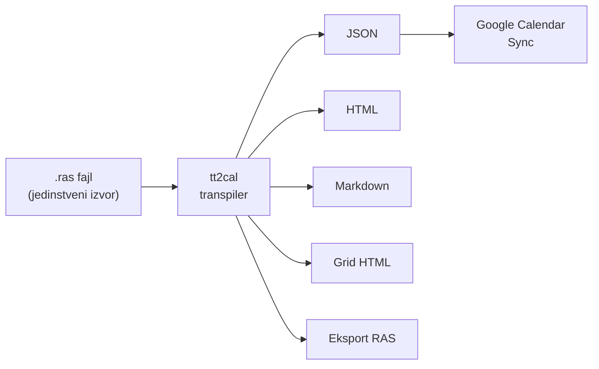
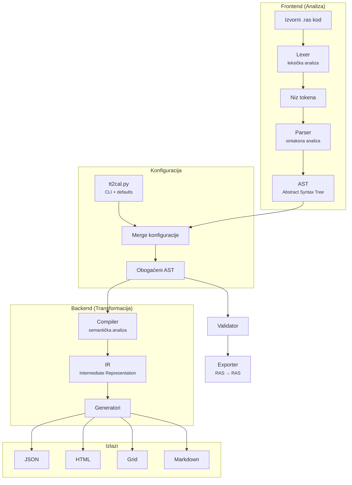
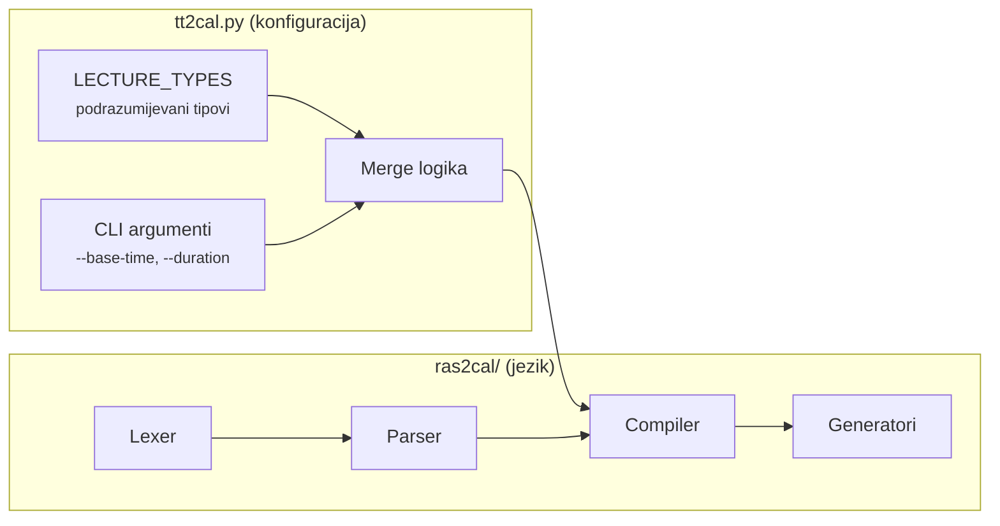
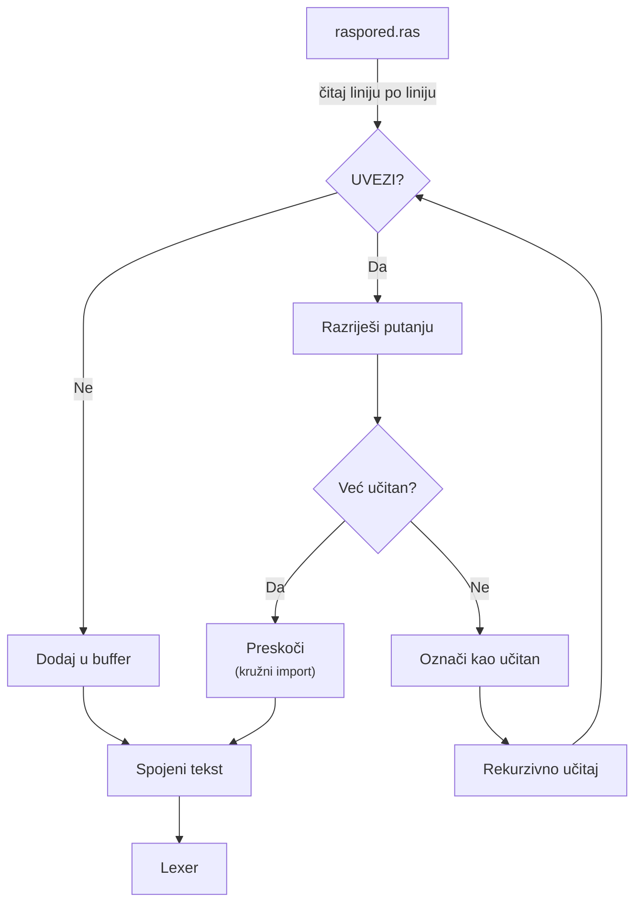
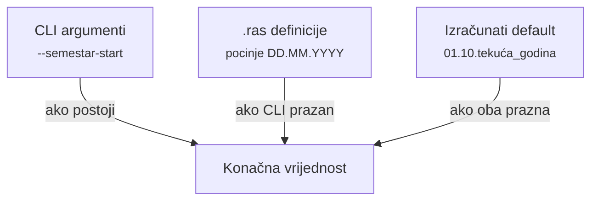
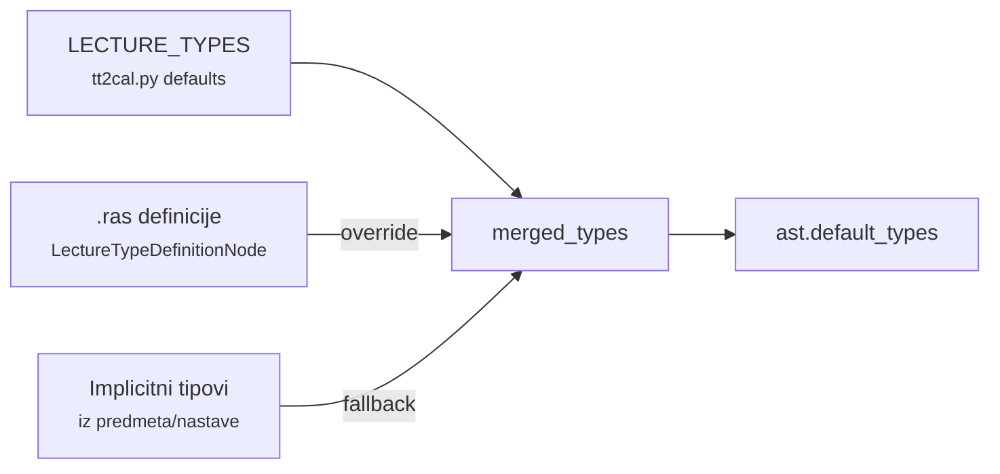
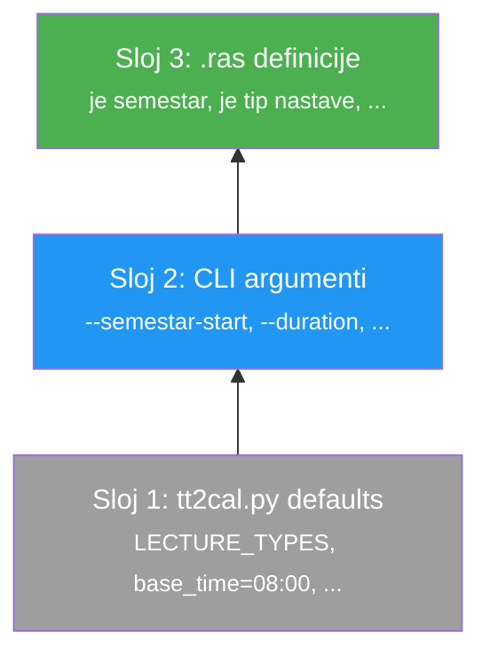
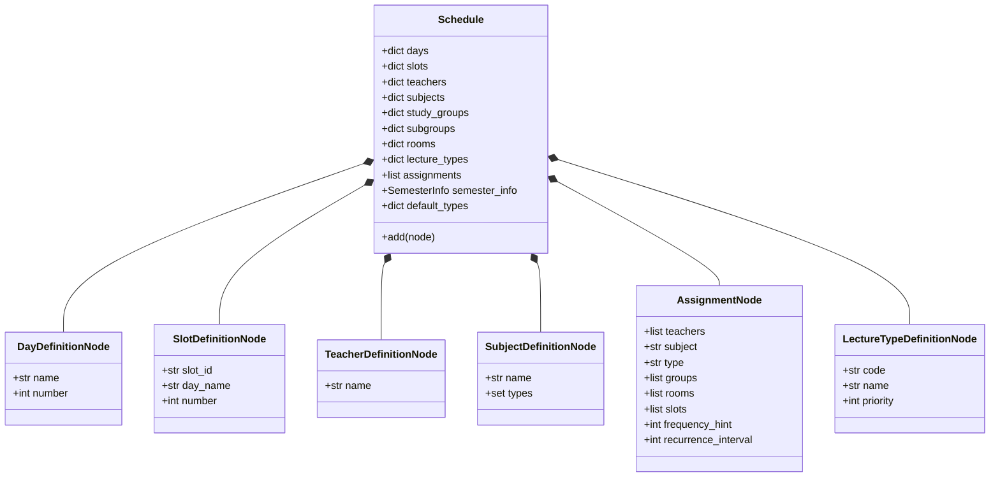
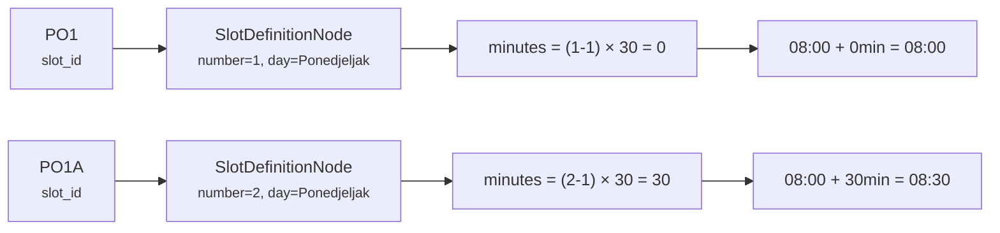
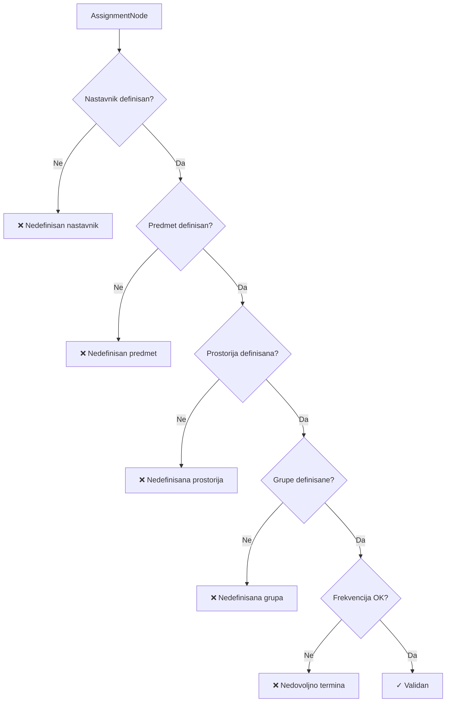

# Analiza i Proširenje Domenski Specifičnog Jezika za Opis Akademskih Rasporeda

**Autor:** Ernedin Zajko  
**Kontakt:** ezajko@root.ba  
**Datum:** Februar 2026.

---

## Sadržaj

1. [Uvod](#1-uvod)
2. [Motivacija i kontekst problema](#2-motivacija-i-kontekst-problema)
3. [Domenski specifični jezici](#3-domenski-specifični-jezici)
4. [Arhitektura transpilera](#4-arhitektura-transpilera)
5. [Formalna specifikacija RAS jezika](#5-formalna-specifikacija-ras-jezika)
6. [Prosirenje 1: UVEZI — Modularni import sistem](#6-prosirenje-1-uvezi--modularni-import-sistem)
7. [Prosirenje 2: Semestar — Temporalna konfiguracija](#7-prosirenje-2-semestar--temporalna-konfiguracija)
8. [Prosirenje 3: Tipovi nastave — Konfiguracijski entiteti](#8-prosirenje-3-tipovi-nastave--konfiguracijski-entiteti)
9. [Hijerarhija konfiguracije](#9-hijerarhija-konfiguracije)
10. [Implementacija kompajlerskog pipeline-a](#10-implementacija-kompajlerskog-pipeline-a)
11. [Validacija i eksport](#11-validacija-i-eksport)
12. [Zaključak](#12-zaključak)
13. [Reference](#13-reference)

---

## 1. Uvod

Upravljanje akademskim rasporedima na visokoškolskim institucijama predstavlja izazov koji kombinuje složena ograničenja resursa (nastavnici, prostorije, grupe studenata) sa vremenskim koordinatama (dani, termini, sedmice). Postojeći pristupi koriste tabelarne editore (Excel, Google Sheets) ili specijalizirane grafičke aplikacije, ali ovi alati imaju ograničenja u pogledu verzioniranja, automatizacije i integracije sa kalendarskim servisima.

Ovaj rad predstavlja **RAS** (Raspored Alokacija Resursa) — domenski specifični jezik (DSL) dizajniran za deklarativno opisivanje akademskih rasporeda, zajedno sa **tt2cal** transpilerom koji RAS kod prevodi u strukturirane izlazne formate (JSON, HTML, Markdown). Poseban fokus je na tri proširenja jezika koja su uvedena kako bi se riješili praktični problemi: modularni import (`UVEZI`), temporalna konfiguracija (`Semestar`) i eksplicitna definicija tipova nastave (`LectureType`).

Rad je organizovan na sljedeći način: Poglavlje 2 opisuje motivaciju i kontekst problema. Poglavlje 3 daje pregled domenski specifičnih jezika. Poglavlja 4 i 5 opisuju arhitekturu transpilera i formalnu specifikaciju jezika. Poglavlja 6, 7 i 8 detaljno analiziraju svako od tri proširenja. Poglavlje 9 objašnjava hijerarhiju konfiguracije. Poglavlje 10 opisuje implementaciju kompajlerskog pipeline-a. Poglavlje 11 pokriva validaciju i eksport, a Poglavlje 12 donosi zaključak.

---

## 2. Motivacija i kontekst problema

### 2.1 Problem akademskih rasporeda

Akademski raspored na Elektrotehničkom fakultetu Univerziteta u Sarajevu (ETF UNSA) obuhvata stotine nastavnih jedinica raspoređenih po pet radnih dana, sa desecima nastavnika, prostorija i studentskih grupa. Svaki semestar zahtijeva kreiranje, ažuriranje i distribuciju rasporeda u više formata:

- **Tabelarni prikaz** za fizičko oglašavanje
- **Kalendarski događaji** za sinhronizaciju sa Google Workspace
- **Filtrirani pogledi** za pojedinačne nastavnike ili grupe

### 2.2 Ograničenja postojećih pristupa

Tabelarni alati (Excel, Google Sheets) nude vizualnu preglednost, ali pate od:

- **Nedostatka verzioniranja**: Promjene se ne mogu pratiti kroz git historiju
- **Ručne konverzije**: Prebacivanje iz tabele u kalendar zahtijeva manuelni rad
- **Nefleksibilnog filtriranja**: Ekstrakcija rasporeda za jednog nastavnika zahtijeva ručno kopiranje
- **Duplikacija podataka**: Isti raspored se održava u više formata nezavisno

### 2.3 Predloženo rješenje

RAS jezik i tt2cal transpiler rješavaju navedene probleme uvođenjem "jednog izvora istine" (single source of truth) — tekstualnog fajla koji se može verzionirati, automatski transformisati i filtrirati. Jedan `.ras` fajl generiše sve potrebne izlazne formate.



---

## 3. Domenski specifični jezici

### 3.1 Definicija

Domenski specifični jezik (Domain-Specific Language, DSL) je programski jezik ograničenog opsega, dizajniran za specifičnu problemsku domenu. Za razliku od jezika opće namjene (General-Purpose Languages, GPL) kao što su Python ili Java, DSL-ovi žrtvuju generalnost u korist ekspresivnosti i čitljivosti unutar svoje domene [1].

### 3.2 Klasifikacija

DSL-ovi se klasificiraju na:

- **Interni DSL-ovi**: Implementirani kao biblioteke unutar host jezika (npr. SQLAlchemy u Pythonu)
- **Eksterni DSL-ovi**: Imaju vlastitu sintaksu i zahtijevaju dedicirani parser (npr. SQL, CSS, RAS)

RAS pripada kategoriji **eksternih DSL-ova** sa deklarativnom paradigmom — korisnik opisuje *šta* raspored sadrži, a ne *kako* ga konstruisati.

### 3.3 Prednosti DSL pristupa za rasporede

| Aspekt | Tabelarni pristup | DSL pristup (RAS) |
| :--- | :--- | :--- |
| Verzioniranje | Ograničeno (binarni formati) | Git-kompatibilno (tekstualni fajlovi) |
| Automatizacija | Ručne skripte | Ugrađen transpiler |
| Modularnost | Jedan fajl | UVEZI direktive |
| Validacija | Manuelna | Automatizirana |
| Filtriranje | Ručno | Regex-bazirano (CLI) |

---

## 4. Arhitektura transpilera

### 4.1 Višefazni pipeline

tt2cal transpiler koristi klasičnu višefaznu arhitekturu kompajlera, adaptiranu za potrebe transformacije (transpilacije) umjesto generisanja mašinskog koda:



### 4.2 Opis faza

**Faza 1 — Leksička analiza (Lexer)**

Lexer pretvara sirovi tekst u niz tokena koristeći regularne izraze. Svaki token ima tip (npr. `JE_NASTAVNIK`, `PREDAJE`, `ID`), vrijednost i broj linije. Komentari i whitespace se odbacuju u ovoj fazi.

**Faza 2 — Sintaksna analiza (Parser)**

Parser konzumira niz tokena i gradi AST (Abstract Syntax Tree) — hijerarhijsku strukturu koja predstavlja značenje izvornog koda. Korijeni čvor je `Schedule` koji agregira sve definicije i iskaze nastave.

**Faza 3 — Konfiguracija i merge**

tt2cal.py postavlja konfiguracijske vrijednosti na AST objekat (vrijeme termina, tipovi nastave, datumi semestra). Ova faza implementira hijerarhiju prioriteta između različitih izvora konfiguracije.

**Faza 4 — Kompajliranje (AST → IR)**

Compiler razrješava reference (slot ID-ovi → konkretna vremena, imena → entiteti sa atributima) i generiše IR (Intermediate Representation) — obogaćeni model sa potpuno razriješenim podacima.

**Faza 5 — Generisanje izlaza**

Generatori čitaju iz IR modela i produciraju konačne izlazne formate.

### 4.3 Razdvajanje odgovornosti

Ključni arhitekturalni princip je strogo razdvajanje između **jezika** (ras2cal modul) i **konfiguracije** (tt2cal.py):



Modul `ras2cal/` ne sadrži nikakve podrazumijevane vrijednosti — sve dolazi od pozivatelja (`tt2cal.py`). Ovo omogućava korištenje istog modula sa različitim konfiguracijama, na primjer za različite fakultete ili obrazovne sisteme.

---

## 5. Formalna specifikacija RAS jezika

### 5.1 Leksička struktura

RAS jezik koristi sljedeće kategorije tokena:

| Kategorija | Primjeri | Opis |
| :--- | :--- | :--- |
| Ključne riječi | `predaje`, `odjeljenju`, `prostoriji` | Fiksne riječi jezika |
| Definicijski iskazi | `je nastavnik`, `je predmet`, `je dan broj` | Složene ključne fraze |
| Identifikatori | `PO1`, `ElmedinSelmanovic`, `RI1-1a` | Proizvoljni nazivi entiteta |
| Literali | `42`, `01.10.2025` | Brojevi i datumi |
| Interpunkcija | `.` | Terminator iskaza |
| Komentari | `// komentar`, `/* blok */` | Ignorisani od lexera |

Lexer koristi regex-bazirani pristup sa prioritetnim redom pravila:

```python
RULES = [
    ('COMMENT',       r'//.*|/\*[\s\S]*?\*/'),
    ('JE_TIP_NASTAVE', r'\bje tip nastave\b'),   # duži prije kraćih
    ('JE_NASTAVNIK',  r'\bje nastavnik\b'),
    ('JE',            r'\bje\b'),                  # najkraći zadnji
    # ...
]
```

Redoslijed pravila je kritičan: duži obrasci moraju prethoditi kraćim. Na primjer, `je tip nastave` mora biti definirano prije `je`, inače bi lexer matchovao samo `je` i prekinuo parsiranje iskaza.

### 5.2 EBNF gramatika

```ebnf
schedule       = { statement } ;

statement      = definition | assignment | import_dir ;

definition     = day_def | slot_def | teacher_def | subject_def
               | room_def | group_def | semester_def | type_def ;

day_def        = ID "je dan broj" NUMBER "." ;
slot_def       = ID "je termin broj" NUMBER "dana" ID "." ;
teacher_def    = ID "je nastavnik" "." ;
subject_def    = ID "je predmet" "." ;
room_def       = ID "je prostorija" "." ;
group_def      = ID ("je odjeljenje" | "je grupa odjeljenja" ID) "." ;
semester_def   = ID "je semestar" "." ;
semester_attr  = ID ("pocinje" DATE | "zavrsava" DATE
               | "traje" NUMBER "sedmica"
               | "ima nenastavne dane" DATE { "," DATE }) "." ;
type_def       = ID "je tip nastave" ID "prioriteta" NUMBER "." ;

assignment     = teacher_list "predaje" ID
                 { group_part } { room_part }
                 [ freq_part ] [ interval_part ]
                 slot_part "." ;

teacher_list   = ID { "i" ID } ;
group_part     = "odjeljenju" ID { "," ID } ;
room_part      = "prostoriji" ID ;
freq_part      = NUMBER "puta sedmicno" ;
interval_part  = "svake" NUMBER "sedmice" ;
slot_part      = "tacno u terminu" { ID } ;

import_dir     = "UVEZI:" PATH ;
```

### 5.3 Semantička pravila

1. **Entiteti se definišu prije upotrebe** — nastavnik, predmet, prostorija i grupa moraju biti deklarisani prije korištenja u iskazu nastave. Ukoliko nisu, validator ih označava kao nevalidne.
2. **Predmeti koriste prefiks za tip nastave** — prvi karakter identifikatora predmeta određuje tip: `p` = Predavanje, `v` = Vježbe, `l` = Lab, `t` = Tutorijal.
3. **Slotovi se referišu po ID-u** — svaki slot mora biti prethodno definisan sa danom i rednim brojem.
4. **CamelCase se automatski formatira** — identifikator `ElmedinSelmanovic` se prikazuje kao "Elmedin Selmanovic" u izlazu.

---

## 6. Proširenje 1: UVEZI — Modularni import sistem

### 6.1 Motivacija

Akademski raspored za jedan fakultet može sadržavati stotine definicija entiteta (nastavnici, predmeti, prostorije) i stotine iskaza nastave. Držanje svega u jednom fajlu donosi praktične probleme:

- **Preglednost**: Fajl od 1000+ linija je teško navigirati
- **Tim rad**: Više osoba ne može paralelno raditi na istom fajlu bez konflikata
- **Ponovna upotreba**: Definicije entiteta (nastavnici, prostorije) su iste iz semestra u semestar, ali se raspored mijenja. Bez modularnosti, definicije se moraju kopirati.
- **Organizacija**: Prirodna struktura podataka (definicije vs. raspored) se gubi u jednom dugačkom fajlu

### 6.2 Dizajn rješenja

Uveden je `UVEZI` mehanizam — direktiva koja se obrađuje na nivou učitavanja izvornog koda, prije leksičke analize:

```text
UVEZI: definicije/nastavnici.ras
UVEZI: definicije/prostorije.ras
UVEZI: definicije/grupe.ras

// Nastava
VedranLjubovic predaje pRazvojSoftvera odjeljenju RI tacno u terminu PO1 PO1A.
```

UVEZI direktiva funkcioniše slično `#include` direktivi u C jeziku ili `import` u Pythonu, ali sa bitnim razlikama:

| Aspekt | C `#include` | Python `import` | RAS `UVEZI` |
| :--- | :--- | :--- | :--- |
| Faza obrade | Preprocesor | Runtime | Pre-leksička |
| Namespace | Globalni | Modularni | Globalni |
| Kružna zaštita | Header guards | Automatska | Detekcija + upozorenje |
| Relativne putanje | Da | Da (paketi) | Da |

### 6.3 Implementacija

Funkcija `load_source_recursive` u modulu `ras2cal/utils.py` implementira UVEZI mehanizam:

```python
def load_source_recursive(file_path, seen=None):
    if seen is None:
        seen = set()

    abs_path = os.path.abspath(file_path)

    # Detekcija kružnog importa
    if abs_path in seen:
        print(f"Upozorenje: Kružni import za '{file_path}'. Preskačem.")
        return ""
    seen.add(abs_path)

    combined_lines = []
    base_dir = os.path.dirname(file_path)

    with open(file_path, 'r', encoding='utf-8') as f:
        for line in f:
            match = re.match(r'^\s*UVEZI:\s*(.+)\s*$', line)
            if match:
                import_path = match.group(1).strip()
                full_path = os.path.join(base_dir, import_path)
                imported = load_source_recursive(full_path, seen)
                combined_lines.append(imported)
            else:
                combined_lines.append(line)

    return "".join(combined_lines)
```

Ključne karakteristike implementacije:

1. **Rekurzivno razrješavanje**: UVEZI direktive u importovanim fajlovima se također razrješavaju
2. **Detekcija ciklusa**: Skup `seen` prati apsolutne putanje već učitanih fajlova, sprječavajući beskonačnu rekurziju
3. **Relativne putanje**: Putanja u UVEZI direktivi je relativna u odnosu na fajl koji sadrži direktivu, ne u odnosu na radni direktorij

### 6.4 Tok obrade



### 6.5 Rezultirajuća struktura projekta

Nakon eksporta, tipičan raspored ima sljedeću strukturu:

```
raspored.ras                    # glavni fajl
├── UVEZI: definicije/semestar.ras
├── UVEZI: definicije/vrijeme.ras
├── UVEZI: definicije/tipovi.ras
├── UVEZI: definicije/nastavnici.ras
├── UVEZI: definicije/predmeti.ras
├── UVEZI: definicije/prostorije.ras
├── UVEZI: definicije/grupe.ras
└── (iskazi nastave)
```

Ovo omogućava verzioniranje gdje se definicije entiteta rijetko mijenjaju (nastavnici, prostorije ostaju isti), dok se sam raspored (assignments) ažurira svaki semestar.

---

## 7. Proširenje 2: Semestar — Temporalna konfiguracija

### 7.1 Motivacija

Originalni RAS jezik opisivao je samo *strukturu* rasporeda — ko predaje šta i kada (u smislu apstraktnih slotova). Međutim, za generisanje kalendarskih događaja potrebne su *apsolutne* vremenske koordinate:

- **Datum početka** semestra (npr. 01.10.2025.)
- **Datum kraja** ili trajanje u sedmicama
- **Nenastavni dani** (državni praznici, fakultetski slobodni dani)

Bez ovih podataka, transpiler ne može izračunati konkretne datume za RRULE (recurrence rule) u kalendarskim događajima, niti filtrirati praznike kao izuzetke (EXDATE).

### 7.2 Dizajn rješenja

Proširenje uvodi pet novih iskaza:

```text
{Naziv} je semestar.
{Naziv} pocinje {DD.MM.YYYY}.
{Naziv} zavrsava {DD.MM.YYYY}.
{Naziv} traje {N} sedmica.
{Naziv} ima nenastavne dane {DD.MM.YYYY}, {DD.MM.YYYY}.
```

Dizajnerske odluke:

1. **Deklarativna forma**: Semestar se deklariše kao entitet (`je semestar`), a zatim mu se dodjeljuju atributi — konzistentno sa ostatkom jezika
2. **Alternativni kraj**: Korisnik može specificirati ili `zavrsava` ili `traje N sedmica`, ali ne mora oba. Transpiler izračunava nedostajuću vrijednost.
3. **Naziv kao identifikator kalendara**: Naziv semestra (npr. `ZimskiSemestar2025`) se automatski formatira u čitak oblik ("Zimski Semestar 2025") i koristi kao naziv Google kalendara
4. **Lokalizirani datumi**: Format datuma je `DD.MM.YYYY` (europski standard), ne američki `MM/DD/YYYY`

### 7.3 Implementacija

Na nivou lexera, dodani su novi tokeni:

```python
('SEMESTAR',      r'\bsemestar\b'),
('POCINJE',       r'\bpocinje\b'),
('ZAVRSAVA',      r'\bzavrsava\b'),
('TRAJE',         r'\btraje\b'),
('IMA',           r'\bima\b'),
('NENASTAVNE',    r'\bnenastavne\b'),
('SEDMICA',       r'\bsedmica\b'),
('SEDMICE',       r'\bsedmice\b'),
('DATE',          r'\d{2}\.\d{2}\.\d{4}'),
```

Na nivou parsera, svaki atribut semestra se mapira na svoj AST čvor:

```python
class SemesterDefinitionNode(ASTNode):
    """Deklaracija semestra: 'ZimskiSemestar2025 je semestar.'"""
    def __init__(self, name):
        self.name = name

class SemesterAttributeNode(ASTNode):
    """Atribut semestra: pocetak, kraj, trajanje, nenastavni dani."""
    def __init__(self, semester_name, attr_type, value):
        self.semester_name = semester_name
        self.attr_type = attr_type   # 'start', 'end', 'duration', 'holidays'
        self.value = value
```

`Schedule` (korijenski AST čvor) konsolidira sve atribute u `SemesterInfo` objekat — specijaliziran `dict` sa čitljivim `__repr__`:

```python
class SemesterInfo(dict):
    """Rjecnik sa semestralnim meta-podacima koji se ispisuje kao AST cvor."""
    def __repr__(self):
        parts = [f"{k}={v!r}" for k, v in self.items()]
        return f"SemesterInfo({', '.join(parts)})"

# U Schedule.__init__():
self.semester_info = SemesterInfo({
    'name': None,
    'start_date': None,
    'end_date': None,
    'duration_weeks': None,
    'holidays': [],
})
```

`SemesterInfo` nasljeđuje `dict` pa sve postojeće operacije (`.get()`, `[]`, `.items()`) rade bez promjene, ali AST debug ispis koristi konzistentan format.

### 7.4 Razrješavanje konfiguracije

Semestralni parametri se razrješavaju u `tt2cal.py` sa trostrukom hijerarhijom:



Algoritam razrješavanja za datum početka:

```python
semester_start = _resolve_date(args.semestar_start)       # 1. CLI
if not semester_start and ast.start_date:
    semester_start = ast.start_date                        # 2. .ras
if not semester_start:
    semester_start = f"{datetime.now().year}-10-01"        # 3. Default
```

### 7.5 Korištenje u generatorima

Razriješeni semestralni parametri propagiraju se kroz cijeli pipeline:

| Parametar | Korištenje |
| :--- | :--- |
| `start_date` | Kalkulacija datuma prvog pojavljivanja eventa |
| `end_date` | RRULE `UNTIL` parametar za ponavljanje |
| `holidays` | RRULE `EXDATE` parametar (izuzetak od ponavljanja) |
| `name` | Naziv kalendara u JSON meta-podacima |

---

## 8. Proširenje 3: Tipovi nastave — Konfiguracijski entiteti

### 8.1 Motivacija

U originalnom dizajnu, tipovi nastave (Predavanje, Vježbe, Lab, Tutorijal) bili su hardkodirani u kodu transpilera. Ovo je donosilo tri problema:

1. **Nefleksibilnost**: Dodavanje novog tipa (npr. "Seminar", "Praksa") zahtijevalo je izmjenu Python koda
2. **Nekonzistentnost**: Nazivi tipova bili su raspršeni po više modula (`md_gen.py`, `html_gen.py`, `compiler.py`)
3. **Nemogućnost prilagodbe**: Različiti fakulteti koriste različite nazive i prioritete tipova nastave

### 8.2 Dizajn rješenja

Uvedena je nova definicijska forma u RAS jeziku:

```text
P je tip nastave Predavanje prioriteta 0.
V je tip nastave Vjezbe prioriteta 1.
L je tip nastave LaboratorijskeVjezbe prioriteta 2.
T je tip nastave Tutorijal prioriteta 3.
```

Svaki tip nastave ima tri atributa:

| Atribut | Opis | Primjer |
| :--- | :--- | :--- |
| **Kod** | Kratki identifikator (jedno slovo) | `P`, `V`, `L` |
| **Naziv** | Čitljivi naziv (CamelCase → razmak) | `Predavanje` |
| **Prioritet** | Redoslijed prikaza (manji = važniji) | `0` |

Prioritet je ključni koncept: određuje redoslijed u tabeli tipova, sortiranje u HTML izlazu, i vizualni naglasak u CSS stilovima.

### 8.3 Implementacija

#### Leksički nivo

Dodana su dva nova tokena:

```python
('JE_TIP_NASTAVE', r'\bje tip nastave\b'),
('PRIORITETA',     r'\bprioriteta\b'),
```

#### AST nivo

```python
class LectureTypeDefinitionNode(ASTNode):
    """Definicija tipa nastave: 'P je tip nastave Predavanje prioriteta 0.'"""
    def __init__(self, code, name, priority):
        self.code = code
        self.name = name
        self.priority = int(priority)
```

#### Konfiguracijski objekat

`LectureType` je definisan kao frozen dataclass koji se dijeli između AST i IR nivoa:

```python
@dataclass(frozen=True)
class LectureType:
    code: str       # "P"
    name: str       # "Predavanje"
    priority: int   # 0

    @property
    def css_class(self):
        return f"tag-{self.code}"
```

Odluka da se `LectureType` definira u `models.py` (AST nivo), a ne u `ir.py` (IR nivo), je namjerna — tipovi nastave se koriste i na AST nivou (za merge konfiguracije) i na IR nivou (za generisanje izlaza).

### 8.4 Merge logika

Spajanje tipova nastave iz različitih izvora implementirano je u `tt2cal.py`:



Algoritam:

```python
# 1. Počni sa defaultima
merged_types = dict(LECTURE_TYPES)

# 2. .ras definicije override-aju defaults
for code, node in ast.lecture_types.items():
    merged_types[code] = LectureType(code, node.name, node.priority)

# 3. Nedefinirani tipovi dobijaju generički fallback
for subj in ast.subjects.values():
    for t_code in subj.types:
        if t_code not in merged_types:
            merged_types[t_code] = LectureType(t_code, t_code, 99)
```

Ova trostepena logika osigurava da:
- Korisnik koji ne definiše tipove dobija razumne podrazumijevane vrijednosti
- Korisnik koji eksplicitno definiše tip ima potpunu kontrolu
- Nepoznati tipovi (greške u unosu) ne ruše transpiler, već dobijaju generički prioritet 99

### 8.5 Upotreba u generatorima

Tipovi nastave se koriste na više mjesta:

| Generator | Upotreba tipa |
| :--- | :--- |
| HTML | CSS klasa (`tag-P`, `tag-V`, ...) za vizualno razlikovanje |
| Grid | Boja ćelije u tabelarnom prikazu |
| Markdown | Labela u izvještaju (`Tip: Predavanje`) |
| JSON | Kod tipa u event objektu |
| Eksport | Generisanje `tipovi.ras` sa EBNF-kompatibilnim iskazima |

---

## 9. Hijerarhija konfiguracije

### 9.1 Problem

Transpiler mora podržavati tri scenarija korištenja sa različitim nivoima kontrole:

1. **Minimalni ulaz**: Korisnik daje samo raspored, sve ostalo je automatski
2. **CLI konfiguracija**: Korisnik specificira datume i parametre pri pokretanju
3. **Potpuna kontrola**: Korisnik definiše sve u .ras fajlu

### 9.2 Rješenje: Troslojna hijerarhija



Svaki viši sloj override-uje niži. Na primjer:

| Parametar | Default (Sloj 1) | CLI (Sloj 2) | .ras (Sloj 3) | Konačno |
| :--- | :--- | :--- | :--- | :--- |
| Početak | 01.10.2025 | `--semestar-start 24.02.` | `pocinje 01.03.` | **01.03.** |
| Tip "P" | Predavanje, prio=0 | — | `prioriteta 5` | **prio=5** |
| base_time | 08:00 | `--base-time 09:00` | — | **09:00** |

### 9.3 Prikaz u AST debug modu

Korisnik može verificirati konačno stanje konfiguracije koristeći `-a` (AST) flag:

```
=== AST STRUKTURA ===
Summary: Schedule(days=5, slots=130, teachers=141, ...)

--- SEMESTER INFO ---
SemesterInfo(name='Semestar2026', start_date='2026-10-01', end_date='2027-01-14', duration_weeks=15, holidays=[])

--- LECTURE TYPES (merged) ---
LectureType(code='P', name='Predavanje', priority=0)
LectureType(code='V', name='Vježbe', priority=1)
LectureType(code='L', name='Laboratorijske vježbe', priority=2)
LectureType(code='T', name='Tutorijal', priority=3)
LectureType(code='N', name='Nepoznato', priority=9)
```

---

## 10. Implementacija kompajlerskog pipeline-a

### 10.1 AST — Apstraktno sintaksno stablo

AST je in-memory reprezentacija parsiranog RAS koda. Korijenski čvor `Schedule` agregira sve definicije:



### 10.2 IR — Intermedijarna reprezentacija

IR je obogaćena verzija AST-a sa razriješenim referencama:

| AST | IR | Razlika |
| :--- | :--- | :--- |
| `slot_id = "PO1"` | `start_time = "08:00"` | Vremena izračunata |
| `teacher = "ImePrezime"` | `Person(id, name, email)` | Entitet sa atributima |
| `groups = [["RI1-1"]]` | `Group(id, name, parent, subgroups)` | Hijerarhija |
| `type = "P"` | `LectureType("P", "Predavanje", 0)` | Obogaćeni tip |
| AssignmentNode | Event | Kompletni kalendarski događaj |

Kompajler (`compiler.py`) gradi IR u tri koraka:

1. **`_build_lookups()`** — kreira rječnike za brz pristup: `people`, `rooms`, `groups`, `subjects`
2. **Hijerarhija grupa** — povezuje roditelje i djecu (npr. RI1 → RI1-1a, RI1-1b)
3. **`_process_assignments()`** — za svaki `AssignmentNode` kreira `Event` sa izračunatim vremenima, datumima i razriješenim entitetima

### 10.3 Razrješavanje vremena

Konverzija apstraktnih slot ID-ova u konkretna vremena je ključna funkcija kompajlera:



Kada nastava zauzima više slotova (npr. PO1 + PO1A), kompajler izračunava:
- **Početak** = minimum svih start vremena = 08:00
- **Kraj** = maksimum svih end vremena = 09:00

### 10.4 Generisanje kalendarskih događaja

Za svaki Event, kompajler izračunava datum prvog pojavljivanja:

```python
# Indeks dana (0-based, Mon=0)
day_idx = day_def.number - 1

# Datum prvog pojavljivanja u semestru
sem_start_weekday = self.semester_start.weekday()
days_diff = (day_idx - sem_start_weekday + 7) % 7
first_date = self.semester_start + timedelta(days=days_diff)
```

Na primjer, ako semestar počinje u ponedjeljak (01.10.) i nastava je u srijedu:
- `day_idx = 2` (srijeda), `sem_start_weekday = 0` (ponedjeljak)
- `days_diff = (2 - 0 + 7) % 7 = 2`
- `first_date = 01.10. + 2 dana = 03.10.` (srijeda)

---

## 11. Validacija i eksport

### 11.1 Validator

Modul `validator.py` provjerava konzistentnost rasporeda:



Validator razdvaja assignments na validne i nevalidne. Nevalidni se eksportuju u zasebni `nevalidno.ras` fajl sa komentarima o razlozima nevalidnosti.

### 11.2 Eksporter

Eksporter (`exporter.py`) implementira obrnuti proces — transformiše AST nazad u RAS format. Ovo je korisno za:

- **Refaktorisanje**: Monolitni fajl se razbija u modularne definicije
- **Čišćenje**: Nevalidni unosi se razdvajaju od validnih
- **Normalizacija**: Format se standardizira

Eksporter generira strukturu sa UVEZI direktivama, čime se zatvara krug:
```
Ulazni .ras → Parse → AST → Validate → Export → Refaktorisani .ras
```

---

## 12. Zaključak

RAS jezik i tt2cal transpiler demonstriraju primjenu principa kompajlerskog dizajna na praktične probleme upravljanja akademskim rasporedima. Tri implementirana proširenja — UVEZI, Semestar i LectureType — adresiraju realne potrebe:

1. **UVEZI** omogućava modularizaciju i ponovnu upotrebu definicija kroz semestre
2. **Semestar** pruža temporalnu konfiguraciju neophodnu za kalendarsku integraciju
3. **LectureType** centralizira upravljanje tipovima nastave sa eksplicitnim prioritetima

Troslojna hijerarhija konfiguracije (.ras > CLI > defaults) osigurava fleksibilnost — od minimalnog ulaza do potpune kontrole. Strogo razdvajanje između jezika (`ras2cal/`) i konfiguracije (`tt2cal.py`) omogućava prilagodbu za različite obrazovne sisteme.

Budući rad uključuje:
- Evoluciju jezika ka RAS 2.0 sa blokovskom sintaksom i atributima entiteta
- Eliminisanje prefiksa predmeta u korist eksplicitnog tipa u iskazu nastave
- Integraciju sa automatskim alociranjem prostorija na osnovu kapaciteta
- Web interfejs za vizualno uređivanje rasporeda sa RAS izlazom

---

## 13. Reference

[1] M. Fowler, "Domain-Specific Languages," Addison-Wesley, 2010.

[2] A. Aho, M. Lam, R. Sethi, J. Ullman, "Compilers: Principles, Techniques, and Tools," 2nd ed., Pearson, 2006.

[3] T. Parr, "Language Implementation Patterns," Pragmatic Bookshelf, 2010.

[4] E. Gamma, R. Helm, R. Johnson, J. Vlissides, "Design Patterns: Elements of Reusable Object-Oriented Software," Addison-Wesley, 1994.

[5] Python Software Foundation, "Python 3 Documentation — dataclasses," https://docs.python.org/3/library/dataclasses.html

[6] Google, "Google Calendar API — Events: insert," https://developers.google.com/calendar/api/v3/reference/events/insert

[7] RFC 5545, "Internet Calendaring and Scheduling Core Object Specification (iCalendar)," IETF, 2009.
